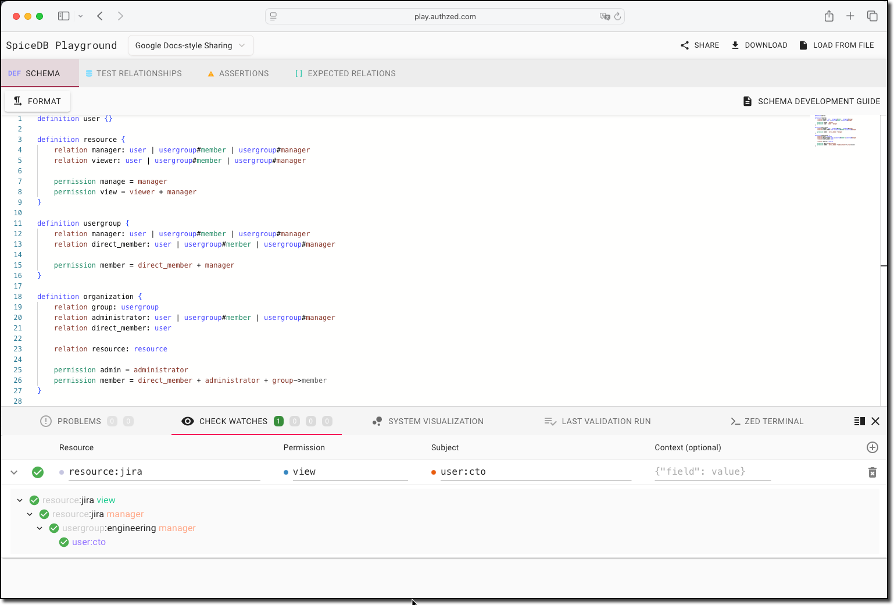

<a href="https://authzed.com#gh-dark-mode-only" target="_blank">
    
</a>
<a href="https://authzed.com#gh-light-mode-only" target="_blank">
    
</a>

# Playground

The [SpiceDB] Playground is an interactive app for building a [SpiceDB] schema, interacting with test relationships, and quickly iterating with test assertions.

Whether you're just getting started learning SpiceDB concepts or need to develop a new permissions system schema for your application, the SpiceDB playground has functionality to help.



Features include:

- Rich text editor with syntax highlighting and tooltips
- Visual relationship editor with support for defining caveat context data
- Developer system that detects and presents schema and data errors
- Real-time check requests against a full SpiceDB instance running client side via WASM
- Fully functional [zed](https://github.com/authzed/zed) CLI instance running client side via WASM
- Schema and relationship graph visualization
- Import and export schema and workspace data as a YAML file

## What is SpiceDB?

SpiceDB is a graph database purpose-built for storing and evaluating access control data.

As of 2021, broken access control became the #1 threat to the web. With SpiceDB, developers finally have the solution to stopping this threat the same way as the hyperscalers.

[SpiceDB]: https://authzed.com/spicedb

# Getting Started

## Run locally

```command
yarn add global serve && yarn build && cd build && serve
```

## Deploying

### Docker

Run the latest Docker container

```command
docker run -it -p 3000:3000 ghcr.io/authzed/spicedb-playground:latest
```

Connect to the running container.

```command
http://<container>:3000
```

### Vercel

Deploy an instance hosted on Vercel

[](https://vercel.com/new/clone?repository-url=https%3A%2F%2Fgithub.com%2Fauthzed%2Fplayground&project-name=spicedb-playground&repository-name=spicedb-playground)

or using the Vercel CLI

```command
vercel build
vercel deploy --prebuilt
```

> ℹ️ Git Large File Storage (LFS) must be enabled in your Vercel project settings.

#### Enabling sharing functionality

To enable the sharing functionality on Vercel, you need to configure the following environment variables in your Vercel project settings:

**Required for sharing:**

- `S3_ENDPOINT` - Your S3-compatible storage endpoint (e.g., `https://s3.amazonaws.com` for AWS S3)
- `S3_BUCKET` - Name of the S3 bucket to store shared playground data
- `SHARE_SALT` - A random string used for generating share hashes (keep this secret)
- `AWS_ACCESS_KEY_ID` - AWS access key for S3 access
- `AWS_SECRET_ACCESS_KEY` - AWS secret key for S3 access
- `VITE_SHARE_API_ENDPOINT` - The URL of your deployed Vercel instance (e.g., `https://your-playground.vercel.app`)

**Optional:**

- `VITE_GOOGLE_ANALYTICS_MEASUREMENT_ID` - Google Analytics measurement ID
- `VITE_DISCORD_CHANNEL_ID` - Discord channel ID for embedded chat
- `VITE_DISCORD_SERVER_ID` - Discord server ID
- `VITE_DISCORD_INVITE_URL` - Discord invite URL (defaults to https://authzed.com/discord)

You can set these environment variables in the Vercel dashboard under your project's _Settings > Environment Variables_.

### Running for development with sharing enabled

The `vercel` CLI can be used to run locally with sharing enabled:

```
VITE_SHARE_API_ENDPOINT=http://localhost:3000 SHARE_SALT=... AWS_ACCESS_KEY_ID=... AWS_SECRET_ACCESS_KEY=... S3_ENDPOINT=... S3_BUCKET=...  vercel dev
```

## Developing your own schema

You can try both [SpiceDB](https://github.com/authzed/spicedb) and [zed](https://github.com/authzed/zed) entirely in your browser on a SpiceDB Playground deployment thanks to the power of [WebAssembly](https://authzed.com/blog/some-assembly-required).

If you don't want to start with the examples loadable from a Playground, you can follow a guide for [developing a schema] or review the the schema language [design documentation].

Watch the SpiceDB primer video to get started with schema development:

<a href="https://www.youtube.com/watch?v=AoK0LrkGFDY" target="_blank"></a>

[developing a schema]: https://authzed.com/docs/spicedb/modeling/developing-a-schema
[design documentation]: https://authzed.com/docs/spicedb/concepts/schema

## Contribute

[CONTRIBUTING.md] documents communication, contribution flow, legal requirements, and common tasks when contributing to the project.

You can find issues by priority: [Urgent], [High], [Medium], [Low], [Maybe].
There are also [good first issues].

Our [documentation website] is also open source if you'd like to clarify anything you find confusing.

[CONTRIBUTING.md]: CONTRIBUTING.md
[Urgent]: https://github.com/authzed/playground/labels/priority%2F0%20urgent
[High]: https://github.com/authzed/playground/labels/priority%2F1%20high
[Medium]: https://github.com/authzed/playground/labels/priority%2F2%20medium
[Low]: https://github.com/authzed/playground/labels/priority%2F3%20low
[Maybe]: https://github.com/authzed/playground/labels/priority%2F4%20maybe
[good first issues]: https://github.com/authzed/playground/labels/hint%2Fgood%20first%20issue
[documentation website]: https://github.com/authzed/docs

## Joining the SpiceDB Community

SpiceDB is a community project where everyone is invited to participate and [feel welcomed].
While the project has a technical goal, participation is not restricted to those with code contributions.
Join our [Community Discord](https://authzed.com/discord) to ask questions and meet other users.

[feel welcomed]: CODE-OF-CONDUCT.md
